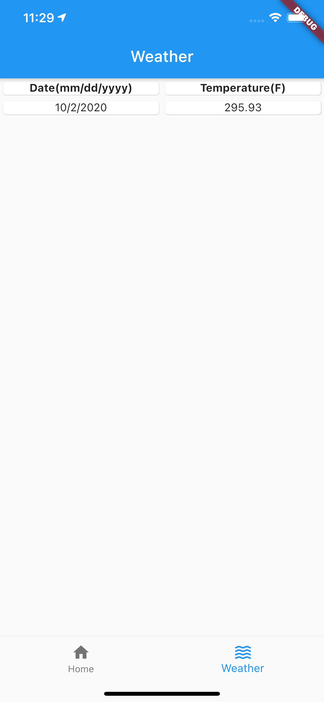

# ehrlich_code_challenge

## Run project

flutter pub get

flutter run -d all

## Run Code Generator

flutter pub run build_runner watch --delete-conflicting-outputs

## Screenshots

        
       

        

  

        

        
  

         

        
  
       
